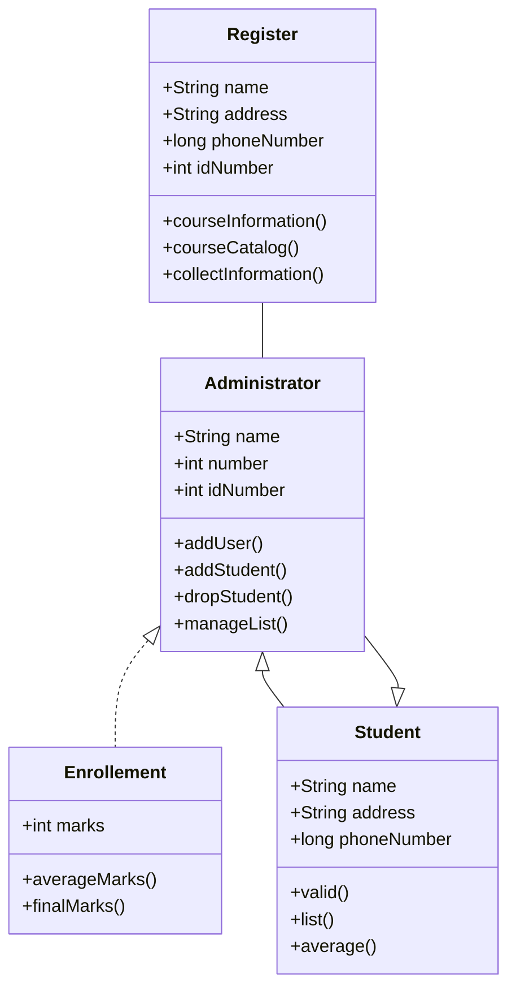

```mermaid
classDiagram
      Register -- Administrator
      Administrator <|.. Enrollement
      Administrator <|-- Student
      Student <|-- Administrator
      
      class Student{
          +String name
          +String address
          +long phoneNumber
          +valid()
          +list()
          +average()
      }
      
      class Enrollement{
          +int marks
          +averageMarks()
          +finalMarks()
      }
      
      class Administrator{
          +String name
          +int number
          +int idNumber
          +addUser()
          +addStudent()
          +dropStudent()
          +manageList()
      }
      
      class Register{
          +String name
          +String address
          +long phoneNumber
          +int idNumber
          +courseInformation()
          +courseCatalog()
          +collectInformation()
      }
```
