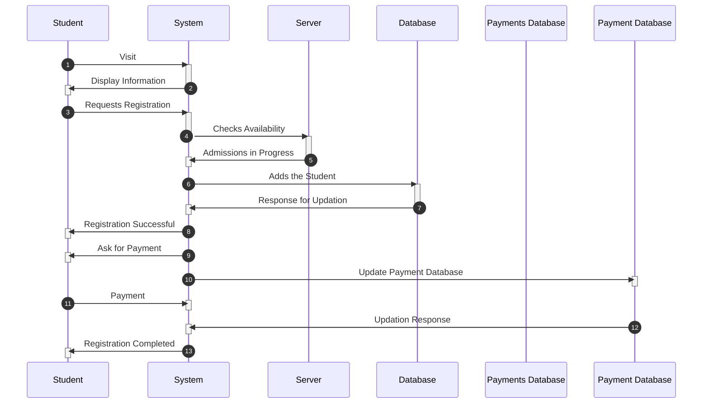

```mermaid
sequenceDiagram
  participant Student
  participant System
  participant Server
  participant Database
  participant Payments Database
  
  autonumber
  
  Student->>System: Visit
  activate System 
  System ->>Student: Display Information
  activate Student 
  deactivate System
  deactivate Student
  
  Student->>System: Requests Registration
  activate System 
  System ->>Server: Checks Availability
  deactivate System
  activate Server 
  Server ->>System: Admissions in Progress
  activate System 
  deactivate System 
  deactivate Server 
  
  System->>Database: Adds the Student
  activate Database 
  Database ->>System: Response for Updation
  activate System 
  deactivate Database
  deactivate System 
  
  System->>Student: Registration Successful
  activate Student
  deactivate Student
  System->>Student: Ask for Payment  
  activate Student   
  deactivate Student 
  
  System->>Payment Database: Update Payment Database
  activate Payment Database
  deactivate Payment Database
  
  Student->>System: Payment
  activate System
  deactivate System
  Payment Database->>System: Updation Response
  activate System
  deactivate System
  
  System->>Student: Registration Completed
  activate Student
  deactivate Student
  
```
